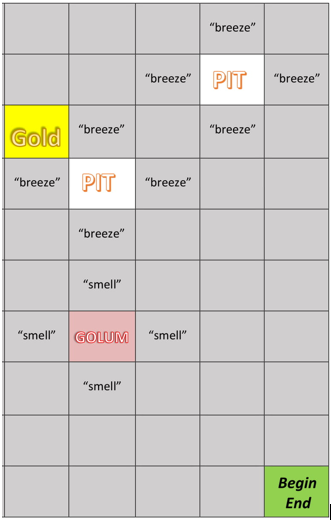

---
layout: default
title: Final Report
--- 

## Video 

Link: https://www.youtube.com/watch?v=5JY5zpqjrW0&feature=youtu.be

<iframe width="560" height="315" src="https://www.youtube.com/embed/5JY5zpqjrW0" frameborder="0" allow="accelerometer; autoplay; encrypted-media; gyroscope; picture-in-picture" allowfullscreen></iframe>

Welcome to Golem Globe where we trained a Minecraft agent how to play our own variation of Wumpus World. In this video we will describe the rules of the game, how we trained our agent, how well it did in the beginning stages of training, and how well it did after. This video is only a brief description of the project. For more details please read the following project report. 

## Project Summary 
Golem Globe, inspired by Wumpus World, is an environment in which a Minecraft agent must traverse through a platform that contains a single block of gold, multiple pits, and multiple monsters. The goal of this project was to create a Minecraft AI that can navigate through a platform of pits and monsters to locate the treasure/gold without falling into a pit or being killed by a monster during its journey. To survive, the agent must make observations of their immediate surroundings and decide which direction will be most rewarding (or least dangerous) for them. If the agent smells a stench it is an indication that they are beside a monster; a breeze indicates that the agent is beside a pit; the sparkles of glitter indicate that the agent has found the gold and have completed their mission. These percepts will help the agent navigate through the platforms. For more information regarding the rules of Golem Globe and a more in-depth explanation of the game please vist our [Home Page](https://soberanc.github.io/GolemGlobe/). 

## Approaches 
To train our agent we incorporated reinforcement learning through Q-Tables in which the agent will record their observations made on a given map as they explore that map in search of the gold. An agent at all times has their "current" memory, which has stored in it the observations and resulting rewards of their current run. If an agent has already been trained on an environment then the agent will not only have their "current" memory but also their "previous" memory to help them make decisions regarding their traversals. 

To start, the agent was trained on a single map that does not change with only one pit and one monster. As the agent explores their environment in search of the gold they are rewarded for accomplishing their mission (locating the gold) and penalized for dying (either from falling into a pit or being killed by a monster). 

During a traversal, an agent is penalized or rewarded based on the actions they take and the observations that they make. These actions and observations, along with the respective reward, is stored in their "current" memory. In addition, the agent also takes note of the tiles that have already been explored. To encourage the agent to explore newer tiles the agent is rewarded some points. 

When the agent is done traversing (either by finding the gold or from dying) it maps all the previous actions it made to the total rewards received and logs their "current" memory into their "previous" memory, clearing their "current" memory for their next attempt at the mission. We created our agent to prioritize the long-term reward, and added some randomness so that it would have a chance to explore new unexplored blocks and encounter more scenarios. 

By running the agent on the same map and recording the results of previous attempts in "previous" memory, the agent begins to associate the observations it made with the reward that it was given, and thus learns which actions to undertake to maximize the reward. 

### Reward System 
The agent begins with 0 points at the start of every mission. 

The agent is rewarded (+) or penalized(-) for the following actions

For every step that an agent takes, be it to an explored tile or to a new tile, they are awarded with -2 points. Every new tile that an agent explores however awards the agent with +3 points. So on an agent's very first attempt on a map every step that leads them to explore a new tile awards them with (+3) + (-2) = +1 point. This encourages an agent to explore the environment. This is especially helpful if the agent has explored most of the tiles on the 10x10 grid and have yet to locate the gold. The agent is encouraged to explore the unexplored areas in hopes of locating the gold. 

If the agent steps on a tile and observes either a breeze or a stench they receive -200 points. This discourages the agent from attempting the same blocks on their next attempt due to the danger surrounding it and encourages them to explore other areas of their environment. The loss in points however still allows the agent to attempt these tiles if they find no other way around it. 

In addition to losing points on a tile with a stench the agent is forced to make a decision - they are forced to attack a monster but must decide in which direction to attack (up/forward, down/backwards, left, or right). If the agent swings its sword and misses they receive -20 points which discourages blind/uneducated attacks. If the monster is killed then the agent is awarded with 150 points. 

If the agent dies for any reason (it fell into a pit, it is killed by a monster, or it reaches its maximum number of allowed steps) it receives -10000 points every time it dies. 

Once the agent locates the gold (is standing on a block of gold) they receive +10000 points for completing their mission. 

### Q-Table Reinforced Learning 
Throughout their missions an agent will always have a "current" memory that retains all observations and actions of the agent as well as the respective rewards. This "current" memory is a Q-Table of 3x3 grids of the map that the agent has already explored containing the observations the agent has made, the actions they have taken, and the respective rewards that they received from each tile. 

Below is an illustrative view of the "current" memory an agent would have stored from traversing the bottom half of the map to the left. 

     

In addition to a "current" memory, an agent, if they have already had a chance to explore their environment (and failed or succeeded), also retains a "previous" memory that stores the "current" memory from all of their previous explorations. 

This "previous" memory is also a Q-Table of 3x3 grids of the map that the agent has already explored (cummulative - for all attempts) that consolidates all previous attempt's data. 

Although an agent is influenced by their "previous" memories they are mostly influenced by their "current" memory. "Previous" memory is mainly used for discouraging an agent to make fatal decisions (any kind of decision that will cause them to die). This knowledge of fatal mistakes assists the agent to be better adapt to their environment. 

The influence of the "previous" memories is determiend by an siFactor in our code that ranges between 0 and 1 (can be changed manually). If the siFactor is at 1, the "previous" memory is the main memory that the agent uses to make decisions. If the siFactor is at 0 then the "current" memory is the main memory that the agent utilizes. Our project uses an siFactor of 0.2 so that only fatal actions from "previous" memory is accounted for when calculating the expected rewards of a certain action that an agent must take.  

Below is an example of how we are storing our Q-Tables on file. All Q-Tables are stored as dictionaries with the keys as a string representation of each 3x3 grids that the agent has observed:

`W U U W S C W C C`

This string can be read as the following 3x3 grid: 

The letters represent: 

The values of each key is a list of tuples that represent the differnt actions that was taken on that matrix, the current reward it produced and the total reward after that action was taken (for the "previous" memory): 

`W U U W S C W C C :
    (f:-10000:-10000)
    (B:-100:-2100.0)` 
    
Here the "f" indicates that the agent had fallen once and received -10000 points and that they had felt a breeze several times in the previous attempts and 5 times during the current attempt. 

A large contributor to our algorithm was the standard gamma equation for machine learning to find an optimal behavior. Throughout this project we attempt to find a policy that maximized the expected value of 

 where  is the immediate reward in time t and  is the discount factor. 

### What Did Not Work 
- In the early stages of our project we were storing the Q-Table as a dictionary in which the keys were the map indices (a single tile inthe map). We later realized that this method was not efficient nor useful as the agent was only able to learn about the current map and was not able to generalize other maps. 

- We also started out weighing all steps/actions taken equally. This method did not work as the agent would tend to repeat their steps. Because of this issue we added the reward of +3 for every new tile that the agent explored, encouraging it to gain more observations about the map and have a better generalization of its environment. 

- Finally as the agent would struggle to find the gold due to the negative rewards they would receive on a tile with breezes and stenches, we increased the randomness factor to ensure that the agent would not be stuck avoiding tiles these tiles and not being able to locate a way around the pits or monsters to find the gold. 

## Evaluations
To evaluate the performace of our agent we used a combination of qualitative and quantitative metrics. 

### Quantitative: 
The primary quantitative metrics we used is the cummulative reward received and the success rate. The cummulative reward is the sum of the agent's rewards from all actions taken. The success rate is the ratio of successful traversals to total attempts made. If our agent receives on average a higher cummulative reward and achieves a greater success rate then we consider this a successful implementation. 

The following are results from a single environment for both training and validation: 

#### Pre-Training Quantitative Results 
As you can see here the agent takes about 10 attempts until the agent successfully locates the gold and their success rate is at a low 10%. 

 

To view the agent training on this specific map please watch our video at the top of this page. 

For these results recall that killing a golem rewards the agent with +150 points. The rewards difference between Trial 2 and Trial 3 indicate that Trial 3 was the first time that the agent was able to kill a golem (after a couple of attempts). 

Trial 10 was the agent's first successful attempt on this map. 

#### Post-Training Quantitative Results 
These results show that after a large number of training sessions with the agent they are able to locate the gold a lot quicker (with less number of steps) and with a success rate of 100% 

### Qualitative: 
The difficulty levels of the maps that the agent explored were based on the number of golems and pits that were on the map. We found that the more pits there were that were clustered together the harder it was for the agent to get past that cluster. 

To verify that the project was successful we created a controlled map that did not change for the agent to train on. Once the agent successfully completed their missions at a high average of at least 90% of the time they moved on to a new map for testing and learning. Our qualitative evaluations showed that our project is successful because after quite a bit of training the agent is able to adapt quicker to new maps by associating the different percepts to certain rewards. 

Our mooonshot case is to create an agent that stops dying and is always able to retrieve the gold for every map. 

## References 
Below is a list of resources we found helpful throughout the development of our project
 - [For monster and item types that can be placed on the map upon start of the mission](https://github.com/microsoft/malmo/blob/master/Schemas/Types.xsd.in)
 - [Tabular Q Learning](https://github.com/Microsoft/malmo/blob/master/Malmo/samples/Python_examples/tabular_q_learning.py)
 - [Gamma Equation for Q-Learning](https://en.wikipedia.org/wiki/Q-learning)
