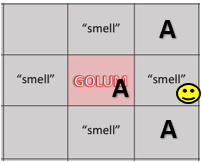
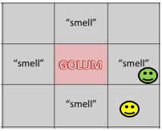
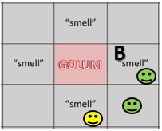

# Golem Globe

## What is Golem Globe?

Golem Globe, is a modified implementation of Wumpus World in Minecraft. In Golem Globe the world is a 10x10 grid map that contains a monster, gold and any number of pits. The agent only has observation of the current block it is on, in other words, it does not know where the gold, pits, or monster is located on the map. However when the agent is adjacent to a pit it feels/observes a breeze, and when it is adjacent to the monster it smells a stench and when it is on the block that has the gold it feels glitter. To win the game the agent needs to navigate through the map to find the gold.  

### Rules of the Game 
- An agent's observations are limited to that of the blocks that they have been to already (explored). 
- An agent may nly move up, down, left, or right - no diagonal movements - a single space at a time. 
- Observations made on a single block applies only to blocks that are above, below, to the left, or to the right of the block. 
- If an agent falls into a pit they die and they have failed their mission 
- If an agent is killed by a monster they have failed their mission
- An agent must stand on a gold block to "retrieve" the treasure 
- There is ever only one block of gold (treasure) in every map. 
- There is a limited number of steps that the agent can take per mission. If they pass that limit then they "die" and fail their mission. 

#### The Environment 
In Golem Globe, the environment consists of: 

- A single emerald block as the starting point 
- A single gold block where the gold/treasure is located
- At least one redstone blocks where a monster stands - these blocks can be located within pits 
  - For the purpose of this game (traversal and observations) we often refer to the monster as the wumpus, the golem, or a specific type of monster (ie. a zombie) depending on what appears on the map. 
- At least one pit in the platform. 
  
#### The Observations 
To survive their mission the agent must make observations of their immediate surroundings (the block that they are on), remember these observations, and make decisions based on their observations. An agent is not able to determine what is adjacent to them (up, down, left, or right) unless they have already been on that block. 

Possible Percepts: 

- “Smell” : If the agent smells a stench, there is a monster adjacent to (up, down, left, or right) the current block 
- “Breeze: If the agent feels a breeze, there is a pit adjacent to (up, down, left, or right) the current block  
- “Glitter”: If the agent sees glitter, they have located the gold 

If the agent does not observe any of the above percepts then they are free to move in any direction (up, down, left, or right) without fear of running into a pit. 

For example: 

If the agent is standing on a block and they "smell" a stench, it is an indicator that there is a monster adjacent to them (up, down, left, or right). For example, say the agent :smiley: has only been to the block it is on now. The only observations it has made from this 3x3 grid is that they smell a stench. Their only knowledge at this point is that anywhere "A" adjacent to them there must be a monster. 

Now imagine (image on the right) that the agent has the observations :alien: and is currently standing on the block :smiley:. Now their observations show that above their current location there is a smell however in their current location they do not observe anything. 

Now let's say that the agent decides to go on to this new block :smiley: (image on the left). Their observations include all of the observations it made from previous moves :alien:. 

At this point the agent observes a smell on this block indicating that there is a monster adjacent to their current block. With all of their previous observations they can now infer that the block above their current position has a high likelihood that there is a monster there due to the fact that the block "B" also exhibits a stench. 

## How does the agent work? 
The agent navigates through the map by utilizing a reinforced learning algorithm incorporating a Q-Table to store observations. The agent remembers observations from previous maps and uses those observations of previous maps along with the Q-table from the current map to learn and choose what step to take next. For more information regarding our Golem Globe Minecraft AI please visit our [Final Report](https://soberanc/github.io/GolemGlobe/final.md)

## Source code:
- [Code](https://github.com/soberanc/GolemGlobe)

### Reports:

 - [Proposal](https://github.com/soberanc/GolemGlobe/blob/master/docs/proposal.md)
 - [Status Report](https://soberanc.github.io/GolemGlobe/status.html)
 - [Final](https://soberanc.github.io/GolemGlobe/final.md)
